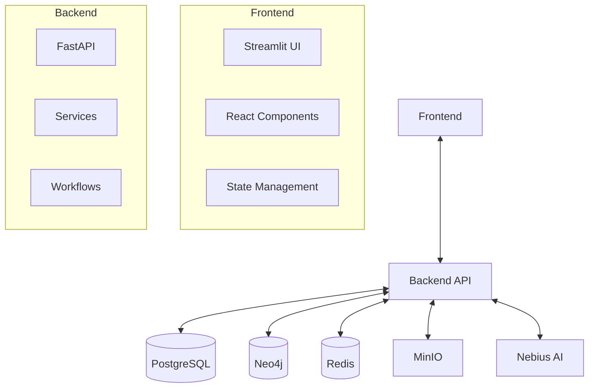
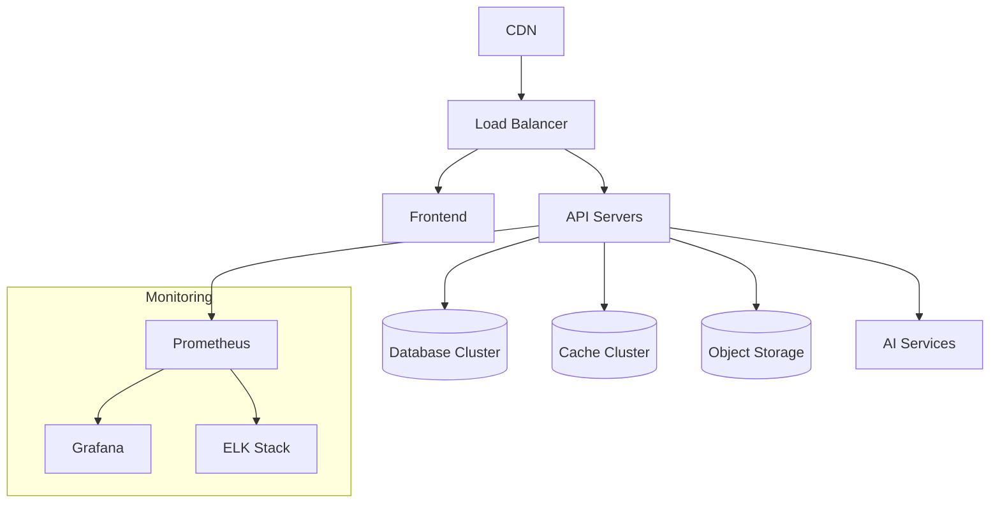

# RecruitIQ Architecture

## Overview

RecruitIQ is built on a modern, modular architecture designed for scalability, maintainability, and performance. The system follows a service-oriented architecture with clear separation of concerns between different components.

## High-Level Architecture

## Core Components

### 1. Frontend

- **Framework**: Streamlit with custom React components
- **State Management**: React Context API
- **Key Features**:
  - Interactive dashboards
  - Real-time updates
  - Responsive design
  - Theme support

### 2. Backend Services

#### API Layer
- **Framework**: FastAPI
- **Authentication**: JWT with OAuth2
- **Rate Limiting**: Redis-based
- **Documentation**: OpenAPI/Swagger

#### Core Services

1. **Resume Parser Service**
   - Hybrid parsing (NLP, LLM, regex)
   - Document processing pipeline
   - Confidence scoring

2. **Candidate Service**
   - Profile management
   - Resume storage
   - Candidate search

3. **Job Service**
   - Job posting management
   - Requirements analysis
   - Matching engine

4. **Matching Service**
   - Semantic search
   - Skills matching
   - Experience evaluation

5. **AI Service**
   - LLM integration (Nebius AI)
   - NLP processing
   - Text generation

### 3. Data Storage

#### Primary Database (PostgreSQL)
- Structured data storage
- ACID compliance
- Full-text search

#### Graph Database (Neo4j)
- Skills graph
- Relationship mapping
- Recommendation engine

#### Cache (Redis)
- Session storage
- Rate limiting
- Temporary data

#### Object Storage (MinIO)
- Resume/CV storage
- Document versioning
- File processing

## Data Flow

### Resume Processing Pipeline

1. **Upload & Preprocessing**
   - File validation
   - Text extraction
   - Format normalization

2. **Parsing & Extraction**
   - Section identification
   - Entity extraction
   - Data validation

3. **Enrichment**
   - Skills normalization
   - Experience validation
   - Education verification

4. **Matching**
   - Job requirements analysis
   - Candidate-job matching
   - Score calculation

## Integration Points

### External Services

1. **Nebius AI**
   - LLM-based extraction
   - Text generation
   - Semantic analysis

2. **Email Service**
   - Notifications
   - Communication
   - Alerts

3. **Calendar Service**
   - Interview scheduling
   - Reminders
   - Availability checking

## Security Considerations

- **Data Encryption**: TLS 1.3, AES-256
- **Authentication**: JWT with refresh tokens
- **Authorization**: Role-based access control (RBAC)
- **Audit Logging**: All sensitive operations
- **Compliance**: GDPR, CCPA ready

## Performance Considerations

- **Caching**: Multi-layer (Redis, in-memory)
- **Indexing**: Optimized database indexes
- **Asynchronous Processing**: Background tasks
- **Load Balancing**: Horizontal scaling
- **CDN**: For static assets

## Monitoring & Observability

- **Logging**: Structured JSON logs
- **Metrics**: Prometheus integration
- **Tracing**: OpenTelemetry
- **Alerting**: Threshold-based alerts

## Deployment Architecture

## Scalability

- **Horizontal Scaling**: Stateless services
- **Database Sharding**: By tenant/organization
- **Read Replicas**: For reporting
- **Queue System**: For background jobs

## High Availability

- **Multi-AZ Deployment**: Cross-zone redundancy
- **Failover**: Automatic database failover
- **Backup**: Point-in-time recovery
- **Disaster Recovery**: Cross-region replication

## Future Considerations

1. **Microservices Migration**
   - Service decomposition
   - Event-driven architecture
   - gRPC for service communication

2. **Machine Learning**
   - Predictive analytics
   - Automated scoring
   - Bias detection

3. **Mobile App**
   - Native experience
   - Offline support
   - Push notifications
